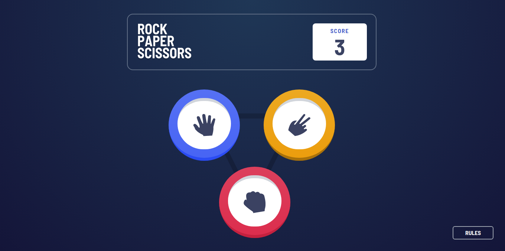

<h1 align="center">
  Rock Paper Scissors Master
</h1>

<p align="center">
  
</p>

<p align="center">
  <a href="https://code-leap-network.vercel.app/">Acessar site</a>
</p>

## Sobre o Projeto

Aplicação do desafio [Rock, Paper, Scissors challenge on Frontend Mentor](https://www.frontendmentor.io/challenges/rock-paper-scissors-game-pTgwgvgH).

## Funcionalidades

- [x] Jogar pedra, papel e tesoura contra a máquina.

- [x] Persistência do score do usuário após refresh do browser.

## Próximas features

- [ ] Layout responsivo.

## Feito com:
- [ReactJS](https://github.com/facebook/react) - Biblioteca Javascript para construção de interfaces.
- [Next.js](https://github.com/vercel/next.js) - Framework React JS.
- [Tailwind](https://tailwindcss.com/) - Biblioteca para estilização.
- [Framer Motion](https://github.com/microsoft/TypeScript) - Biblioteca para animações React.
- [Typescript](https://github.com/microsoft/TypeScript) - Supertset para Javascript.
- [React-modal](https://github.com/reactjs/react-modal) - Biblioteca para construção de modal.
- [Phosphor-react](https://github.com/reactjs/react-modal) - Biblioteca de ícones.

## Como executar

```
$ git clone https://github.com/Garcez17/rock-paper-scissors-master
$ cd rock-paper-scissors-master
$ npm i
$ npm run dev
```

## Licença

Esse projeto está sob a licença MIT. Veja o arquivo [LICENSE](https://github.com/Garcez17/rock-paper-scissors-master/blob/main/LICENSE) para mais detalhes.